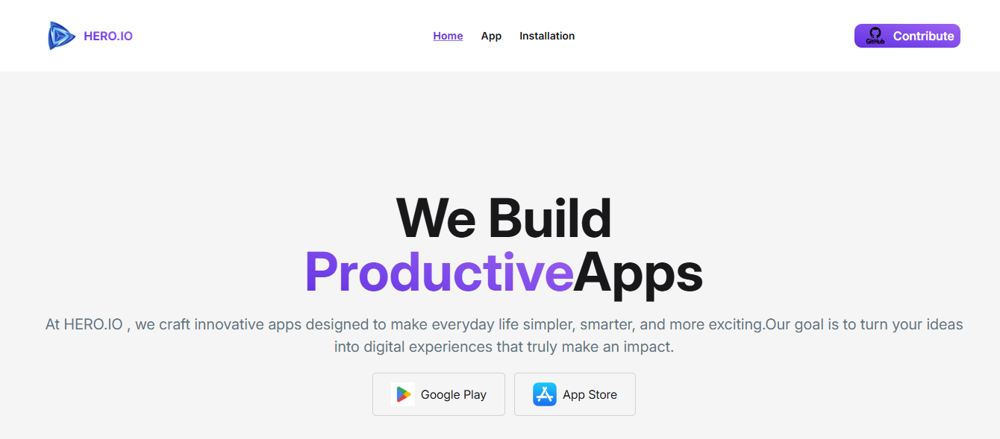

  

##📱 Assignment 8 – Mobile App

This project is a complete mobile‑focused web application built with React and Vite.
It implements a responsive UI with key mobile app‑like features and smooth navigation.
The project demonstrates practical usage of modern frontend tools including React, Tailwind CSS.
This template helps organize and structure UI components like a real mobile interface.

🔗 Live Demo
 https://app-store-assignmet-8.netlify.app/

🛠️ Technologies Used

React.js

Vite

Tailwind CSS

DaisyUI 

ESLint

🚀 Key Features

Responsive layout optimized for mobile screens

Clean navigation between sections

Reusable and modular React components

Structured CSS with Tailwind for fast UI design

Fast loading with Vite development tooling

Simple component hierarchy and folder structure

Mobile‑first design principles

📦 NPM Packages Used

react

react‑dom

vite

tailwindcss

daisyui

eslint

▶️ Getting Started

To run this project locally, follow these steps:

1️⃣ Clone the repository
git clone https://github.com/Tanvir4321-git/Assignment-8-Mobile-App.git

2️⃣ Go to project directory
cd Assignment-8-Mobile-App

3️⃣ Install dependencies
npm install

4️⃣ Start development server
npm run dev
